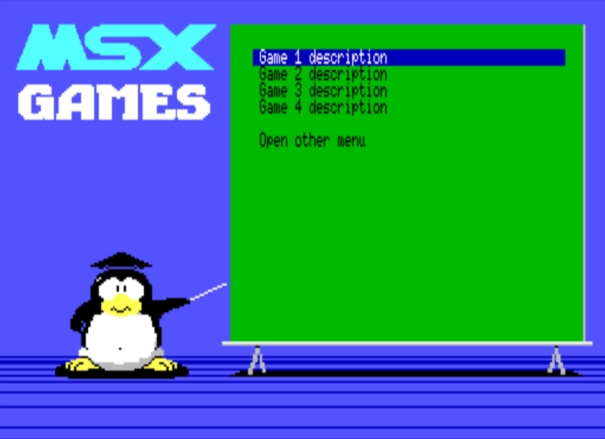

# NMENU - A Simple and Customizable Menu Program for MSX-DOS



NMENU is a utility for MSX-DOS 2 (or higher) that allows you to create simple, navigable menus. These menus can be used to launch programs (.COM, .BAT), MSX ROM files (typically via a loader like SROM.COM), or even other NMENU INI files to create nested or multi-page menus.

**Author:** Natalia Pujol Cremades (NataliaPC) \
**License:** [MIT License](LICENSE)

## Table of Contents

- [Introduction](#introduction)
- [Features](#features)
- [Requirements](#requirements)
- [Usage](#usage)
- [Configuration (NMENU.INI)](#configuration-nmenuini)
- [Controls](#controls)
- [Building from Source](#building-from-source)
- [Third-Party Libraries](#third-party-libraries)
- [Detailed Help](#detailed-help)

## Introduction

NMENU provides a customizable way to organize and launch your MSX software. It's designed for MSX2 or higher systems to take advantage of their graphical capabilities. The menu's appearance and behavior are defined through a simple INI configuration file.

## Features

*   **Customizable Menus:** Define menu items, text, and actions.
*   **Launchers:** Execute .COM programs, .BAT batch files, or load ROM files (via a loader).
*   **Nested Menus:** Link NMENU INI files to create multi-page or sub-menus.
*   **Graphical Backgrounds:** Supports SCREEN 7 (SC7) image files.
*   **ANSI Art Backgrounds:** Supports ANSI art files (.ANS) for text-based backgrounds.
*   **Solid Color Backgrounds:** Set a simple background color.
*   **Background Music:** Play LVGM (.LVM) format music files ([see MSXgl proyect](https://github.com/aoineko-fr/MSXgl)).
*   **Customizable Option Appearance:** Control foreground and background colors for normal and selected menu items.
*   **Flexible Layout:** Position menu items freely on the screen.

## Requirements

*   **MSX-DOS 2** or a higher version.
*   **MSX2 computer** or higher (MSX1 is not supported).

## Usage

To run NMENU, use the following command-line syntax from MSX-DOS:

```dos
NMENU <INI_FILE_PATH>
```

-   `<INI_FILE_PATH>`: The path to the INI configuration file NMENU should load.

If no `<INI_FILE_PATH>` is provided, NMENU will attempt to load `NMENU.INI` from the current directory.

**Example:**

```dos
A:>NMENU MYGAMEZ.INI
```

## Configuration (NMENU.INI)

NMENU is configured using a plain text INI file. This file defines the menu's appearance, settings, and the options available.

The INI file is structured into sections:

*   `[Background]`: Defines the screen background (solid color, SC7 image, or ANSI art).
    *   `bg.color`: ANSI background color code.
    *   `bg.file.sc7`: Path to an SC7 image file.
    *   `bg.file.ansi`: Path to an ANSI art file.
*   `[Settings]`: Controls operational settings.
    *   `music.lvgm`: Path to an LVGM music file.
    *   `option.fr.color`, `option.bg.color`: Default colors for menu items.
    *   `selected.fr.color`, `selected.bg.color`: Colors for the highlighted menu item.
*   `[Options]`: Defines the actual menu entries.
    *   `posx`, `posy`: Screen coordinates (1-based) for the menu item text.
    *   `text`: The display text for the menu item.
    *   `exec`: The command to execute (e.g., `SROM MYGAME.ROM`, `PROGRAM.COM`, `SUBMENU.INI`).
    *   `next`: Marks the end of the current item's definition.

For a detailed explanation of the INI file format, color codes, and advanced positioning, please refer to the [NMENU.HLP](NMENU.HLP) file.

**Example `nmenu.ini` snippet:**

```ini
[Background]
# Blue background
bg.color=44
# SC7 image
bg.file.sc7=bg3.sc7

[Settings]
music.lvgm=lvgm\opll_unde.lvm
# Black text
option.fr.color=30
# Green background
option.bg.color=42
# Bright White text (selected)
selected.fr.color=1;37
# Blue background (selected)
selected.bg.color=44

[Options]
posx=5
posy=3
text=Launch Game Alpha
exec=srom /Q roms\alpha.rom
next

text=Run Utility
exec=utils\myutil.com
next
```

## Controls

*   **UP ARROW:** Move selection to the previous menu item.
*   **DOWN ARROW:** Move selection to the next menu item.
*   **RETURN (ENTER) / SPACEBAR / SELECT (Joystick Button 1/A):** Execute the selected menu item.
*   **ESC (ESCAPE):** Stop music (if playing) and exit NMENU to DOS.

## Building from Source

This project uses SDCC (Small Device C Compiler) for Z80 to compile. A `Makefile` is provided to automate the build process. You'll likely need a Docker environment with an appropriate SDCC image (see `Makefile` for `DOCKER_IMG` details) or a local SDCC installation configured for MSX development.

To build the project:

```sh
make
```

This will compile the source code and produce `nmenu.com` in the `obj` and `dsk` directories.

## Third-Party Libraries

NMENU utilizes the following third-party libraries, which are included in the `contrib` directory. These libraries are not part of NMENU itself and are governed by their own licenses.

### 1. lvgm / MSXgl

*   **Description:** MSXgl is a Game Library wrote in C and targeting MSX computers. `lvgm` is a part of MSXgl used for playing LVGM format music files.
*   **Author(s):** @aoineko-fr (https://github.com/aoineko-fr)
*   **Version:** v1.2.4
*   **Original Source:** [https://github.com/aoineko-fr/MSXgl](https://github.com/aoineko-fr/MSXgl)
*   **License:** CC-BY-SA-4.0 license
*   **Details:** See [contrib/README.lvgm](contrib/README.lvgm)

### 2. msx2ansi

*   **Description:** MSX2ANSI is a very, very, very fast ANSI COLOR Text Rendering engine for MSX2 and beyond.
*   **Author(s):** Oduvaldo Pavan Junior, based in ANSI-DRV.BIN from Tobias Keizer
*   **Version:** v1.7
*   **Original Source:** [https://github.com/ducasp/MSX-Development/tree/master/SDCC/MSX2ANSI](https://github.com/ducasp/MSX-Development/tree/master/SDCC/MSX2ANSI)
*   **License:** "It is a SDCC library that can be freely used on any MSX2 or higher project. :)"
*   **Details:** See [contrib/README.msx2ansi](contrib/README.msx2ansi)

## Detailed Help

For a comprehensive guide to NMENU, including all INI file options, color codes, and operational notes, please consult the [NMENU.HLP](NMENU.HLP) file included in this repository.
